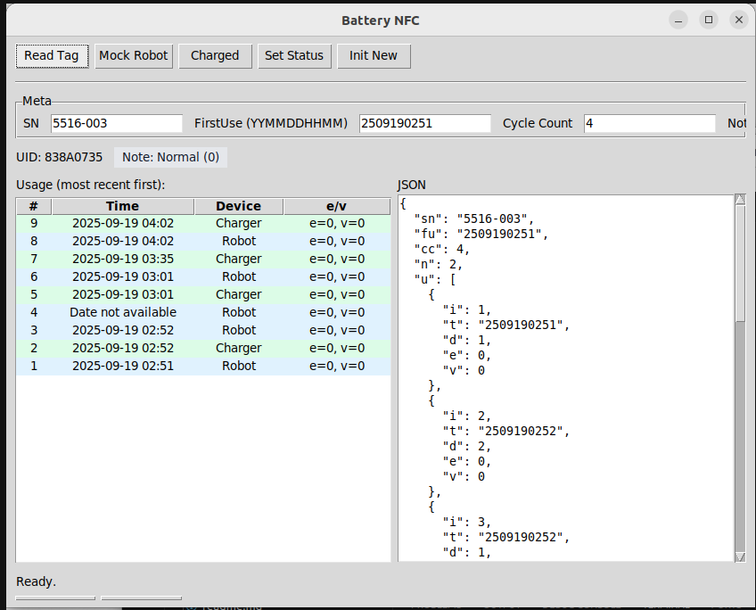
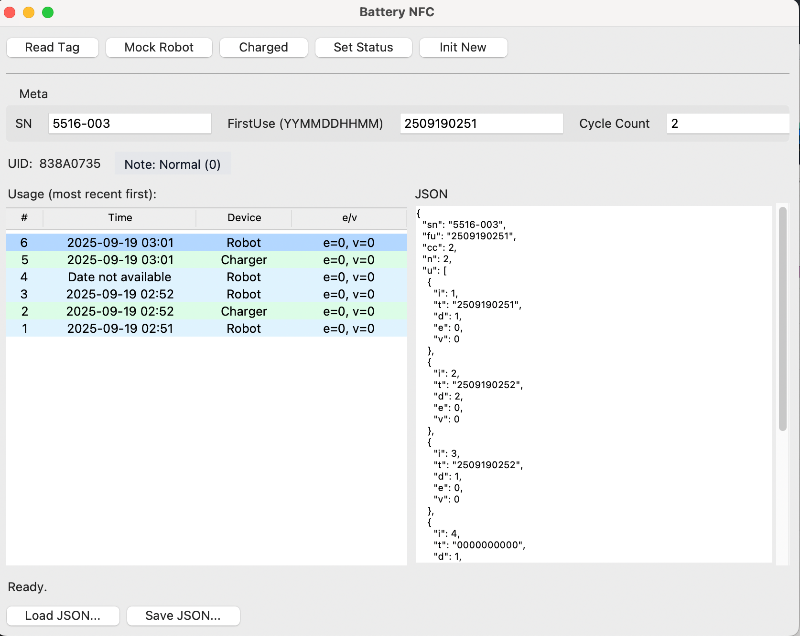
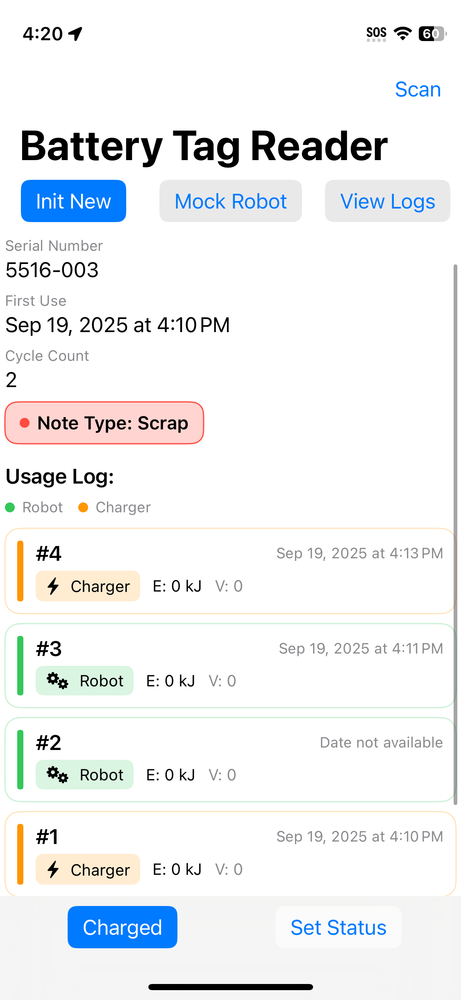

# Battery Tag reader 

Full Documentation and robot side, visit another repository

https://github.com/sikaxn/FRC-Custom-CAN-Sensor/tree/main/Arduino/Battery_Tracking

# Android version

# Python version (Windows / macOS / Ubuntu)

# iOS version

